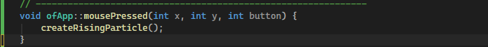
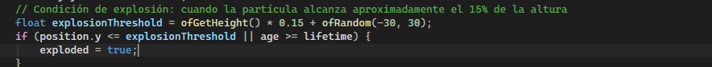
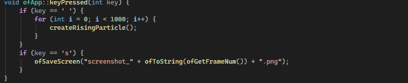
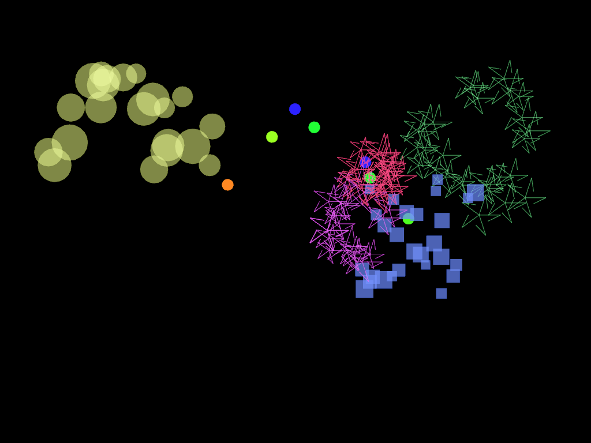
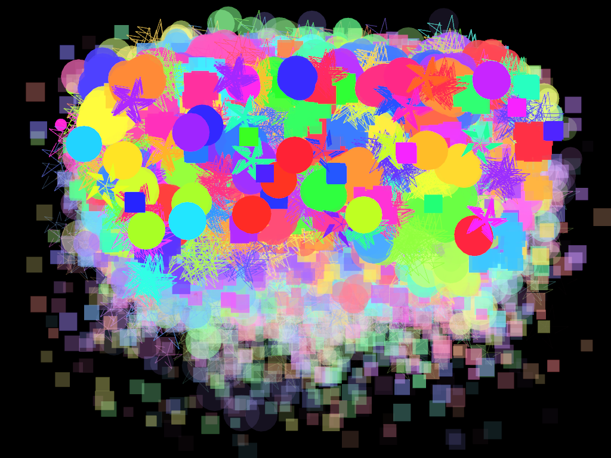
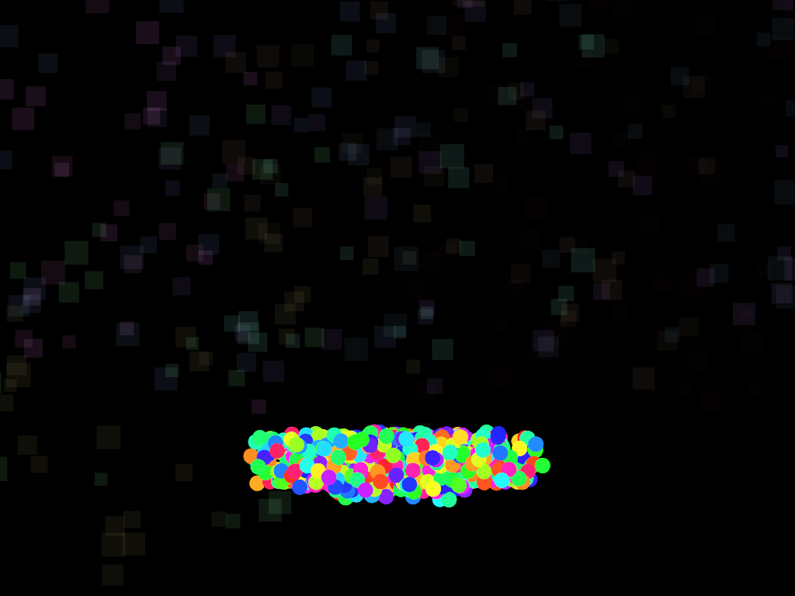
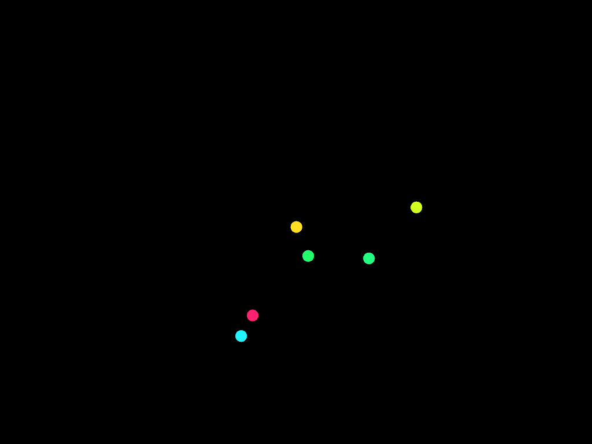

# Unidad 3
## Actividad 1

## Actividad 2: Aplicacion
El codigo hace que al dar click en la pantalla se genere una esfera de un color randomizado y cuando pasan entre 1.5 y 3.5 segundos la esfera mantiene flotando hasta que "dt" que se va actualizando con el tiempo del sistema y le va sumando a "age" si age es mayor igual al tiempo osea "lifetime" la esfera explota explsando unas particulas con formas y colores randomizados
y cuando le das al espacio generan una 1000 esferas al mismo tiempo explotando por igual y cuando se la da a la "s" hace una captura de pantalla almacenando esas capturas en la carpeta "data" tambien explota si la esfera llega a la altura de 15 pixeles.

### captiras de pantalla
Cuando le das click genera la esfera

Cuando explota por el maximo de 15 pixeles o cuando age sea mayo igual a lifetime

Cuando le das al espacio generando 1000 esferas y cuando le das a la "s" sacando captura de pantalla
   