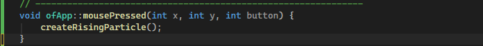
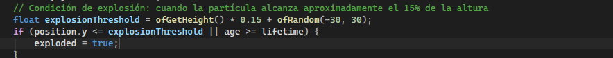
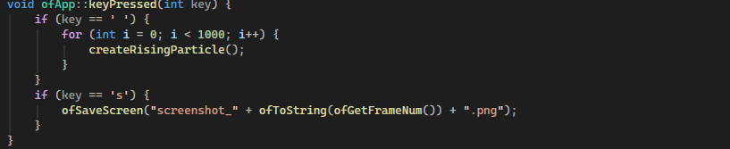
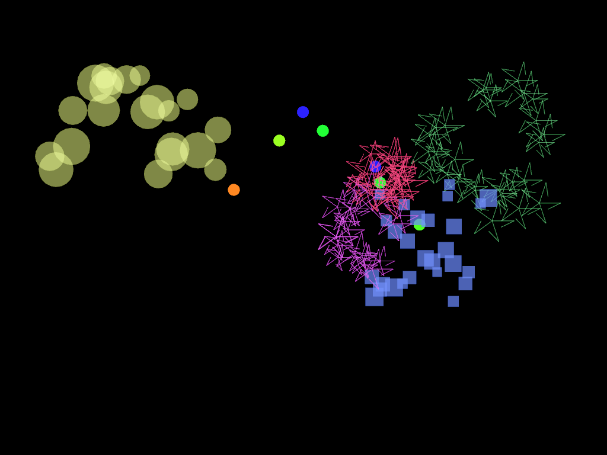
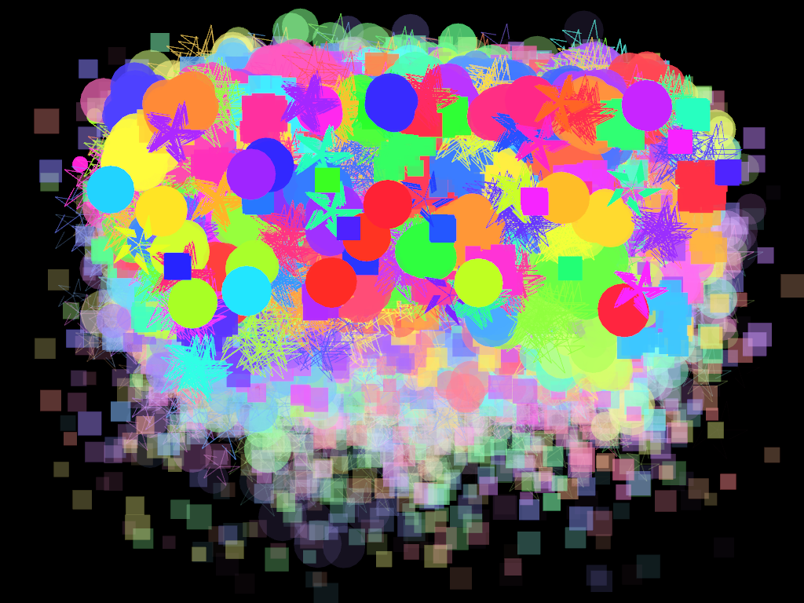
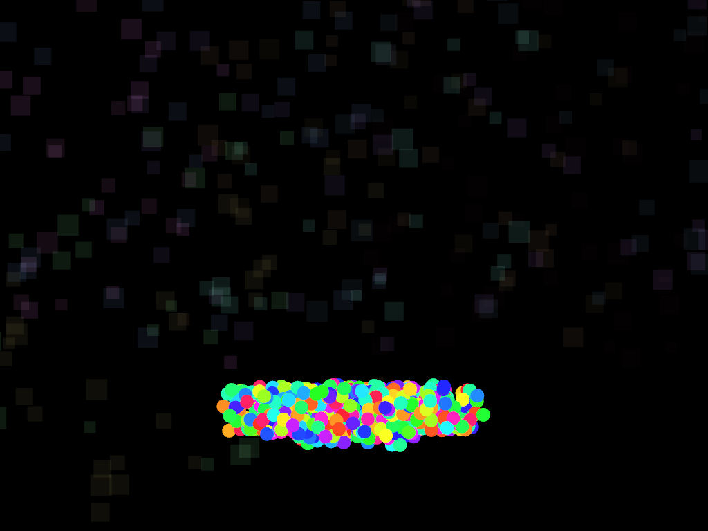
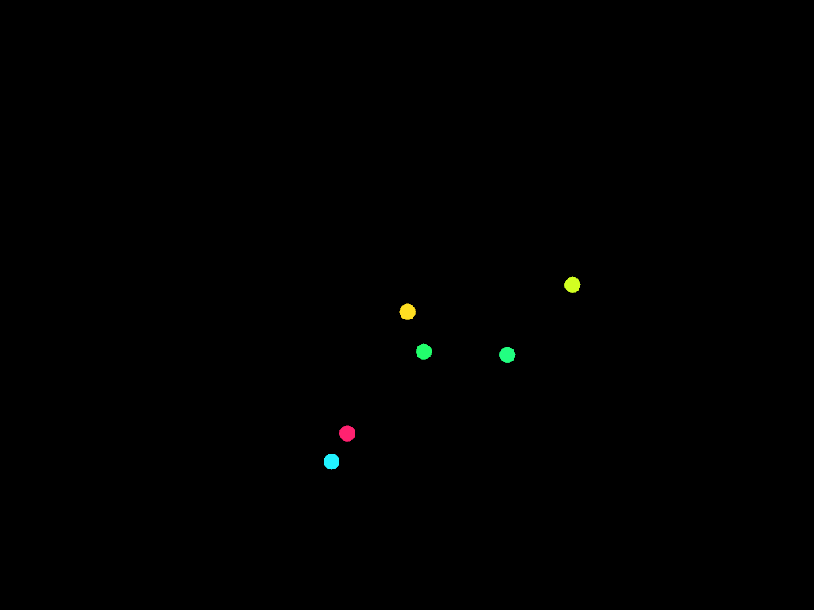
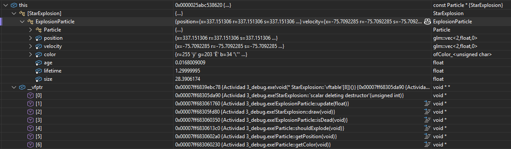
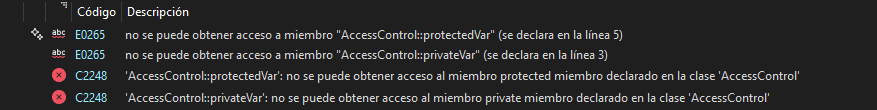

# Unidad 3
## Actividad 1

## Actividad 2: Aplicacion
El codigo hace que al dar click en la pantalla se genere una esfera de un color randomizado y cuando pasan entre 1.5 y 3.5 segundos la esfera mantiene flotando hasta que ``"dt"`` que se va actualizando con el tiempo del sistema y le va sumando a ``"age"`` si age es mayor igual al tiempo osea ``"lifetime"`` la esfera explota explsando unas particulas con formas y colores randomizados
y cuando le das al espacio generan una 1000 esferas al mismo tiempo explotando por igual y cuando se la da a la ``"s"`` hace una captura de pantalla almacenando esas capturas en la carpeta ``"data"`` tambien explota si la esfera llega a la altura de 15 pixeles.

### captiras de pantalla
Cuando le das click genera la esfera

Cuando explota por el maximo de 15 pixeles o cuando age sea mayo igual a lifetime

Cuando le das al espacio generando 1000 esferas y cuando le das a la "s" sacando captura de pantalla
   

## Actividad 3
# ¿Que pude observar?
Que en _vfptr de ``StarExplosion`` por ejemplo tiene 8 entradas y que no todas apuntan a funciones de ``StarExplosion``, la mayoria apuntan a ``particle`` o a ``ExplosionParticle`` y solo ``draw`` apunta hacia ``StarExplosion:draw``
# ¿Que informacion me proporciono el depurador?
Muestra que para cada metodo virtual declarado en la jerarquia la cual es la implementacion "real" que se ejecutara la direccion de memoria y el nombre calificado de la funcion no solo la parte declarada en ``particle``
# En conclusion
Una clase derivada solo reemplaza en _vfptr las entradas de los metodos que sobreescribe el resto de entradas se heredan tal cual de la clase base. Esto es lo que permite que el mismo puntero ``Particle``ejecute automaticamente el codigo correcto segun el tipo real del objeto.



## Actividad 4 (Encasuplamiento)
### ¿Qué sucede al ejecutar el codigo?
al ejecutar el codigo no sucede nada pero cuando descomento las 2 lineas ocurren 4 errores 2 repetidos con diferente codigo lo que pasa es que hay variables protegidas o privadas lo que ```main()``` no puede acceder a esas variables. 
### ¿Porque sucede esto?
Porque las variables estan protegidas y privatizadas.
### Conclusion

## Actividad 5

## Actividad 6

## Actividad 7
