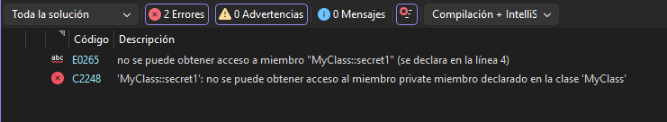
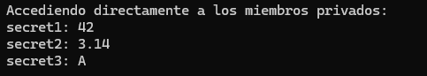
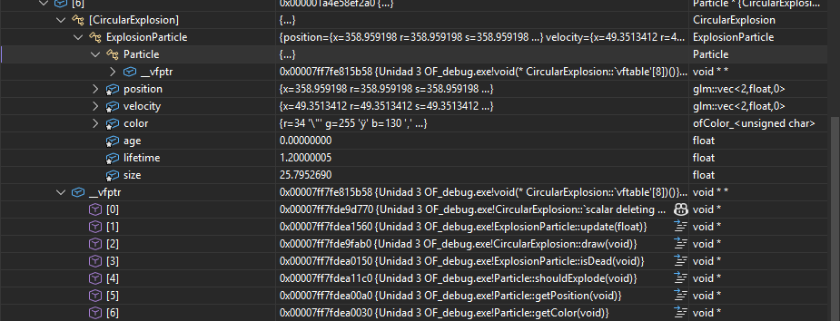
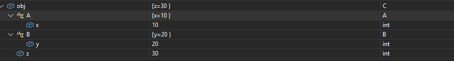
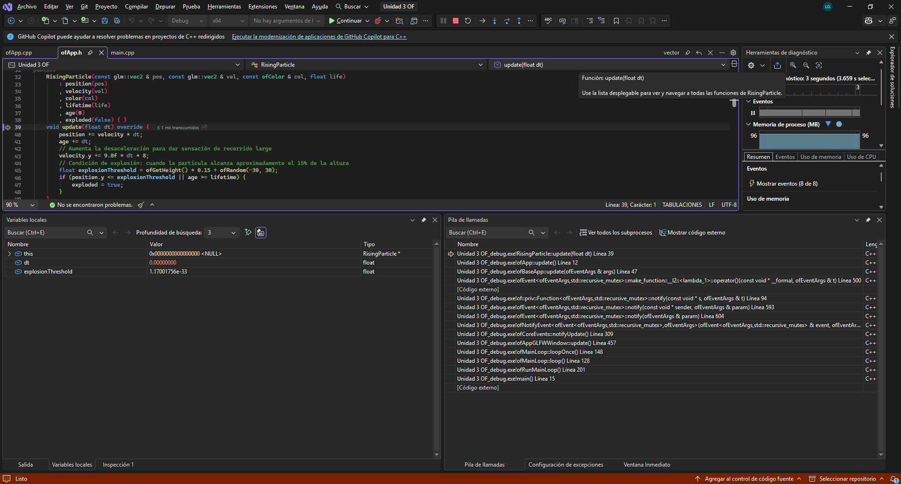

# Unidad 3
## Actividad 1

## Actividad 2: Aplicacion
El codigo hace que al dar click en la pantalla se genere una esfera de un color randomizado y cuando pasan entre 1.5 y 3.5 segundos la esfera mantiene flotando hasta que ``"dt"`` que se va actualizando con el tiempo del sistema y le va sumando a ``"age"`` si age es mayor igual al tiempo osea ``"lifetime"`` la esfera explota explsando unas particulas con formas y colores randomizados
y cuando le das al espacio generan una 1000 esferas al mismo tiempo explotando por igual y cuando se la da a la ``"s"`` hace una captura de pantalla almacenando esas capturas en la carpeta ``"data"`` tambien explota si la esfera llega a la altura de 15 pixeles.

### captiras de pantalla
Cuando le das click genera la esfera

Cuando explota por el maximo de 15 pixeles o cuando age sea mayo igual a lifetime

Cuando le das al espacio generando 1000 esferas y cuando le das a la "s" sacando captura de pantalla
   

## Actividad 3
# ¿Que pude observar?
Que en _vfptr de ``StarExplosion`` por ejemplo tiene 8 entradas y que no todas apuntan a funciones de ``StarExplosion``, la mayoria apuntan a ``particle`` o a ``ExplosionParticle`` y solo ``draw`` apunta hacia ``StarExplosion:draw``
# ¿Que informacion me proporciono el depurador?
Muestra que para cada metodo virtual declarado en la jerarquia la cual es la implementacion "real" que se ejecutara la direccion de memoria y el nombre calificado de la funcion no solo la parte declarada en ``particle``
# En conclusion
Una clase derivada solo reemplaza en _vfptr las entradas de los metodos que sobreescribe el resto de entradas se heredan tal cual de la clase base. Esto es lo que permite que el mismo puntero ``Particle``ejecute automaticamente el codigo correcto segun el tipo real del objeto.


## Actividad 4 (Encasuplamiento)

### 1.  ¿Qué sucede al ejecutar el codigo?
al ejecutar el codigo no sucede nada pero cuando descomento las 2 lineas ocurren 4 errores 2 repetidos con diferente codigo lo que pasa es que hay variables protegidas o privadas lo que ```main()``` no puede acceder a esas variables. 
### ¿Porque sucede esto?
Porque las variables estan protegidas y privatizadas.
### Conclusion
el encapsulamiento en C++ es una regla que el compilador aplica en tiempo de compilacion segun quien intenta acceder al miembro y desde donde no depende del contenido ni de la posicion en memoria, sino del contexto del codigo que hace la llamada
### 2. ¿Que pasa?
El codigo imprimio que que ```MyClass::secret1``` no tiene acceso al ```private``` 

Y Cuando ejecute el segundo codigo funciono perfectamente porque ```reinterpret_cast``` es una forma de saltarse el sistema de tipos y acceso del compilador. Esto demuestra que el encasuplamiento realmente no existe en la memoria a pesar que este ahi escrito. 
### Conclusion
El uso de ```reinterpret_cast``` junto con aritmetica de punteros permite traspasar la restriccion de acceso ```private```, porque reinterpreta la direccion de memoria del objeto como si fuera de otro tipo, evadiendo el chequeo de acceso que el compilador aplica normalmente cuando se accede por el nombre del campo a traves del tipo original de la clase.
### ¿Qué es el encapsulamiento? ¿Por qué es importante?
Es el que declara una variable como ```private, public, protected``` es importante para decir cuando se lee y cuando no la informacion
## Actividad 5 (Herencia)
### ¿Qué puedes observar?
AL expandir el objeto ```CircularExplosion``` en el depurador se ve que esta compuesto por capas anidadas que reflejan exactamente su jerarquia de herencia primero sale ```Particle``` la clase base que tiene el puntero ```_vfptr```, despues esta ```Explosionparticle``` con sus propios campos ```Position, Velocity, color, age, lifetime, size``` por ultimo esta ```CircularExplosion```, que no agrega campos nuevos, solo reemplaza el comportamiento de ```draw()```
### ¿Qué información te proporciona el depurador?
El depurador muestra la estructura interna del objeto en la memoria.

### Conclusion
El campo de la clase ```CircularExplosion``` es una clase que hereda de ```ExplosionParticle``` que hereda de ```Particle``` que vendria ser la clase base y es a travez de el polimorfismo tambien presentado en ```_vtable``` podemos tener subclases como ```CircularExplosion``` y ```StarExplosion```


### Herencia multiple (Experimento)

## Actividad 6 (Polimorfismo)
Cada Objeto de la subclase guarda un ```vptr``` oculto el puntero apunta a la ``` vtable``` de su clase donde la funcion de ```particles``` y ```update``` se traduce a leer el puntero del objeto ubicar la posicion de update y saltar a esa direccion lo que seria un despacho dinamico esto gracias a virtual que genera el polimorfismo que genera los 3 tipos de explosiones durante la ejecucion.


## Actividad 7
